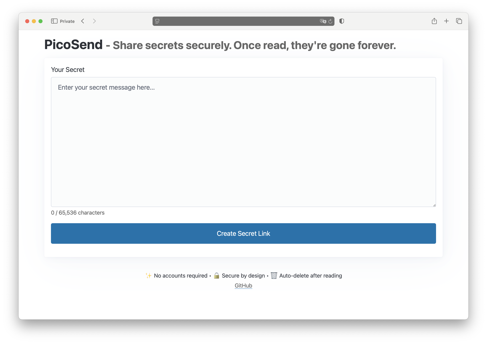

# picosend [](https://github.com/bsv9/picosend/actions/workflows/ci.yml)&nbsp;[](https://coveralls.io/github/bsv9/picosend?branch=main)


A minimalistic application for sharing secrets securely with one-time access.



## Features

- **One-time secret sharing** - Secrets are automatically deleted after being read once
- **Configurable lifetime** - Set secrets to expire after 5 minutes, 1 hour, or 1 day
- **True end-to-end encryption** - Server never sees your plaintext or encryption key
- **No persistent storage** - Secrets stored only in memory
- **No user accounts required** - Anonymous and hassle-free sharing
- **Self-hostable** - Deploy on your own infrastructure
- **Open source** - Transparent and auditable code
- **Robot protection** - Seamless verification code system
- **Minimalistic design** - Simple and intuitive user interface
- **Secure Password Generation** - Generates strong, random passwords for enhanced security

## Quick Start


### Using Docker

```bash
# Pull the image
docker pull docker.io/bsv9/picosend

# Run with default settings
docker run -p 8080:8080 -d docker.io/bsv9/picosend

# Access picosend
open http://localhost:8080
```

> **Note**: The Docker image supports multiple architectures including amd64, arm64 allowing it to run on a variety of platforms including Raspberry Pi, AWS Graviton instances, and Apple Silicon devices.

### Manual Installation

```bash
# Clone the repository
git clone https://github.com/bsv9/picosend.git
cd picosend

# Build the application
go build -o picosend

# Run with default settings
./picosend

```

## Security Features

### End-to-End Encryption

Picosend implements true end-to-end encryption where the server **never** has access to your plaintext data or encryption keys:

1. **Key Generation** - A random 256-bit AES key is generated entirely in your browser
2. **Local Encryption** - Your secret is encrypted client-side using AES-256-CBC before leaving your device
3. **Key in URL Fragment** - The encryption key is embedded in the URL hash fragment (`#`), which is never sent to the server
4. **Server Stores Ciphertext Only** - The server only receives and stores the encrypted content
5. **Local Decryption** - When the recipient opens the link, decryption happens entirely in their browser

```
Secret Link: https://example.com/s/abc123#<encryption-key>
                                         ↑
                            Hash fragment never sent to server
```

### Additional Security

- **Automatic secret deletion** after first retrieval
- **Time-based expiration** ensures secrets are deleted even if not accessed
- **Background cleanup** removes expired secrets from memory
- **Memory is securely wiped** after secret deletion
- **No logging of sensitive data** - Only encrypted content touches the server

## License

MIT
